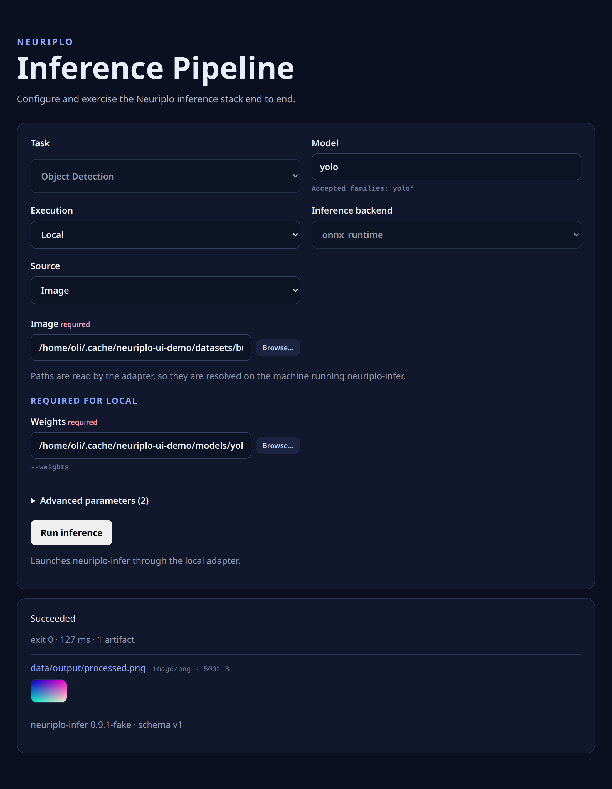
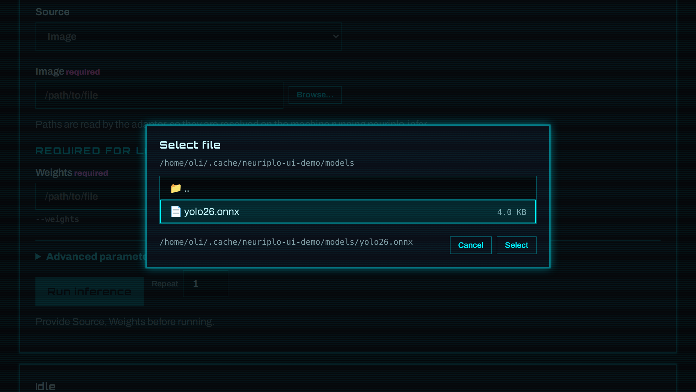

# Neuriplo UI

Web UI and end-to-end test harness for the Neuriplo inference pipeline.

The UI discovers tasks, models, backends, workflows, sources, and advanced
parameters from `neuriplo-infer --capabilities`; the frontend does not hard-code
them.



## Features

- Run local or client-server inference from the browser.
- Inspect results, producer timings, logs, artifacts, and the exact command.
- Browse paths on the adapter machine for sources and weights.
- Retain, repeat, and compare runs in the current browser session.
- Exercise the workflow with Playwright.

## Quick start

```bash
npm install
export NEURIPLO_INFER_BIN=/path/to/neuriplo-infer
npm run dev
```

The web app and adapter bind to `127.0.0.1`. To expose the UI proxy deliberately,
set `NEURIPLO_UI_HOST=0.0.0.0`. The web app proxies `/api` to
`http://127.0.0.1:5174` by default; change it with `NEURIPLO_UI_API`.

Useful commands:

```bash
npm run lint       # Check formatting, lint, and import order
npm run format     # Apply formatting and lint fixes
npm run typecheck  # Type-check the UI, adapter, and E2E harness
npm test           # Run unit tests
npm run build      # Build both applications
npm run test:e2e   # Run the Playwright browser matrix
```

The optional `.devcontainer/` includes the browsers and system libraries needed
by Playwright. You must still provide `neuriplo-infer`, weights, and any runtime.

## How it works

The local adapter validates the producer's capability contract, validates run
requests against it, and starts `neuriplo-infer` with an argument array. Each run
gets an isolated working directory. The response includes the exit code, wall
time, output, command, artifacts, and any structured result.

When advertised by the producer, versioned run reports supply per-stage timings
and failure attribution. Missing measurements are not inferred. The duration in
the run header is whole-process wall time, not inference latency.

The file picker reads the adapter machine's filesystem because browser file
inputs do not provide usable local paths and weights should not be uploaded for
each run.



Run history is browser-only and resets on reload. Comparisons show values side
by side without computing winners or speedups. Repeats run sequentially and
report count, minimum, median, and maximum for compatible configurations.

For client-server workflows, the adapter can inspect KServe V2 server and model
metadata. Remote hosts default to loopback and must be allowed explicitly with
`NEURIPLO_UI_REMOTE_ALLOW`; redirects are disabled and responses have timeout
and size limits.

## Adapter configuration

| Variable | Purpose |
| --- | --- |
| `NEURIPLO_INFER_BIN` | Required path to `neuriplo-infer`. |
| `NEURIPLO_UI_RUN_ROOT` | Per-run directory root; defaults to `neuriplo-ui-runs` under the system temporary directory. |
| `NEURIPLO_UI_RUN_TIMEOUT_MS` | Run timeout; defaults to `300000`. |
| `NEURIPLO_UI_SOURCE_ROOT` | Refuse source paths outside this directory. |
| `NEURIPLO_UI_BROWSE_ROOT` | Confine the file picker to this directory. |
| `NEURIPLO_UI_REMOTE_ALLOW` | Allowed remote `host` or `host:port` values, comma-separated; defaults to loopback. |
| `HOST`, `PORT` | Adapter address; defaults to `127.0.0.1:5174`. |

## End-to-end tests

```bash
npm run test:e2e
```

By default, Playwright builds both apps and uses the fixture producer in
`e2e/fixtures/producer/`, so no model or weights are required. Test a real binary
with:

```bash
NEURIPLO_INFER_BIN=/path/to/neuriplo-infer npm run test:e2e
```

Provide real inputs as needed:

| Variable | Purpose |
| --- | --- |
| `NEURIPLO_UI_E2E_IMAGE` | Image source for image-based tasks. |
| `NEURIPLO_UI_E2E_VIDEO` | Video source. |
| `NEURIPLO_UI_E2E_WEIGHTS` | Weights for path-typed parameters. |
| `NEURIPLO_UI_E2E_ENDPOINT` | Client-server endpoint. |
| `NEURIPLO_UI_E2E_RUNTIME` | Built `neuriplo-kserve-runtime` to start for remote tests. |
| `NEURIPLO_UI_E2E_REMOTE_MODEL` | Model selector for the full client-server round trip. |
| `NEURIPLO_UI_BROWSE_ROOT` | Browse and source root containing the assets above. |

Failures leave traces, screenshots, videos, and server logs under
`e2e/test-results/output/`.

## Repository layout

```text
apps/web/     React and TypeScript UI
apps/server/  Local API adapter
e2e/          Playwright tests and fixture producer
specs/        Mission, stack, and design notes
```
